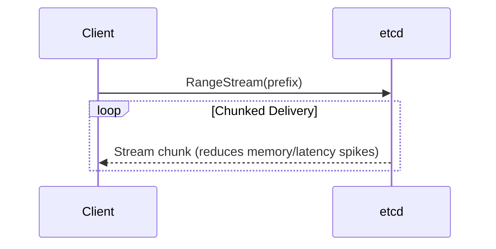

# Architecture & Consensus

## RangeStream RPC
Historically, etcd buffered full result sets in memory before transmission, leading to severe memory spikes and unpredictable latency on large range queries. The new `RangeStream` RPC replaces buffering with chunked streaming.


*Implementation Note:* In Kubernetes v1.37, this is enabled via the `EtcdRangeStream` feature gate.

## Raft Consistency & Stale Reads
To prevent split-brain stale reads during network partitions, the `ReadIndex` flow now injects a unique identifier into the heartbeat context for read-only operations. Raft v3.7.0 also allows booting from partly initialized snapshots, which supports etcd's new v3store-only bootstrap architecture.

# Storage Engine (bbolt v1.5.1)

## Keys-Only Range Optimization
Range requests fetching only keys now bypass disk-backed value deserialization, reading solely from the in-memory index.

```bash
# Leverages fast-path in-memory index
# WARNING: Bypassed if SortTarget=VALUE is specified.
etcdctl get --prefix /registry/pods --keys-only
```

## Hard Storage Quotas and Statistics
`bbolt` now enforces strict database file size limits. If the limit is exceeded, write operations are hard-rejected until the database is compacted or limits are adjusted. Additionally, setting the `NoStatistics` flag disables the database statistics viewer to remove lock contention overhead in high-throughput environments.

## Lease Lifecycle Tuning
- **Overload Handling:** `LeaseRevoke` requests are highly prioritized to ensure timely lock release during control plane saturation.
- **Fast Renewal:** `FastLeaseKeepAlive` bypasses waiting for the applied index, drastically accelerating lease renewals.

# Network & Client Contracts

## Unix Socket Support
Single-member clusters can now bind to Unix sockets, bypassing the TCP stack entirely for edge deployments and local development environments.

```yaml
# etcd config snippet
listen-client-urls: unix://var/run/etcd/etcd.sock
```

## Non-Blocking Client Initialization
The legacy `grpc.WithBlock` dial option is removed. Client creation is now strictly non-blocking. Applications expecting blocking behavior must implement manual connection state polling.

## Direct JWT Injection
Client v3 allows manual injection of JWTs, bypassing authentication negotiation overhead. `AuthStatus` can also be queried without requiring prior authentication.

```go
// Direct JWT configuration pattern for Client v3
client, err := clientv3.New(clientv3.Config{
    Endpoints:   []string{"localhost:2379"},
    DialOptions: []grpc.DialOption{grpc.WithPerRPCCredentials(customJWTCreds)},
})
```

## Protobuf Migration
Dependencies on legacy `gogo/protobuf` and `golang/protobuf` are replaced with `google.golang.org/protobuf`. While this reduces baseline CPU utilization, clients consuming etcd Go modules (`api/` or `pkg/`) must update their downstream Protobuf implementations to resolve breaking API changes.

# Operational Lifecycle

## v3store Bootstrap & Legacy Deprecation
etcd now bootstraps directly from the `v3store`, bypassing the legacy `v2store` startup sequence. Legacy v2 discovery, requests, and client logic are entirely removed.
*Migration Nuance:* To maintain backward compatibility through the v3.7 lifecycle, etcd continues generating v2 snapshots. The `--snapshot-count` flag is temporarily retained until its permanent removal in v3.8.

## Feature Gates Replace Experimental Flags
etcd has adopted the Kubernetes Feature Gate lifecycle (Alpha → Beta → GA). All `--experimental-*` flags have been purged. Configurations must migrate to their equivalent feature gates prior to upgrading.

## Multi-Arch Container Images
Container images are published strictly as multi-arch manifests. Architecture-specific tags (e.g., `v3.7.0-amd64`) are discontinued.

## Observability
New Prometheus metrics expose the latency profile of the watch and request paths:
```text
etcd_server_request_duration_seconds
etcd_debugging_server_watch_send_loop_watch_stream_duration_seconds
etcd_debugging_server_watch_send_loop_control_stream_duration_seconds
etcd_debugging_server_watch_send_loop_progress_duration_seconds