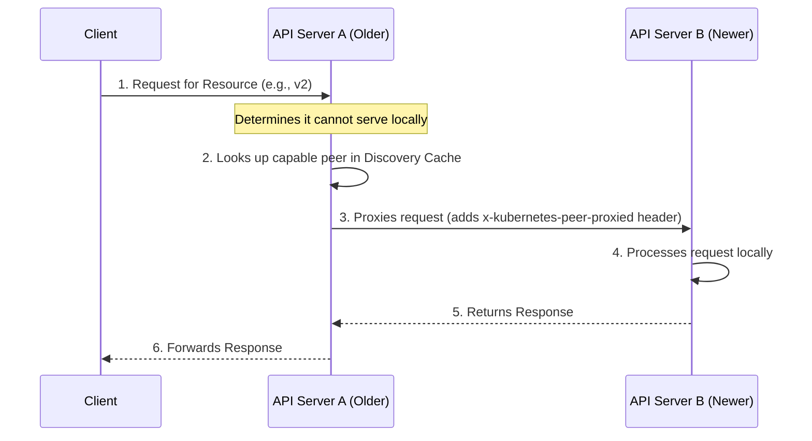
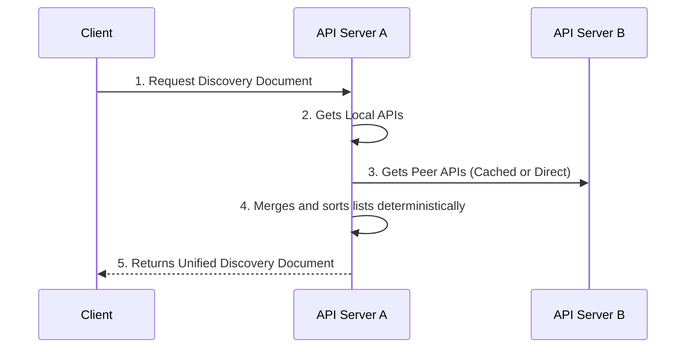

## Architecture Overview
In highly available Kubernetes control planes, rolling upgrades result in a mixed-version state where older API servers do not recognize newly introduced API resources. By default, a request hitting an older API server for a new resource returns `404 Not Found`. This false negative can trigger destructive side effects, such as mistaken garbage collection or blocked namespace deletions.

The Mixed Version Proxy (MVP) solves this by routing unrecognized resource requests to a peer API server capable of handling them.



## Implementation Changes in v1.36 Beta
The Beta release introduces two significant architectural shifts from the Alpha implementation:

### 1. Aggregated Discovery Replaces StorageVersion API
The initial implementation relied on the `StorageVersion` API to determine peer capabilities, which fundamentally lacked support for CustomResourceDefinitions (CRDs) and aggregated APIs. MVP now leverages **Aggregated Discovery** data to dynamically map peer capabilities, fully supporting CRDs and extension API servers.

### 2. Peer-Aggregated Discovery
Previously, discovery requests (e.g., listing available APIs) only returned the local API server's knowledge. In v1.36, the API server merges its local discovery data with data from all active peers. Clients receive a unified view of all available cluster APIs, regardless of the entrypoint server.



**Bypassing Aggregation**: Clients requiring the strict local view of a specific API server can bypass aggregation by specifying `profile=nopeer` in the `Accept` header:
```http
Accept: application/json;g=apidiscovery.k8s.io;v=v2;as=APIGroupDiscoveryList;profile=nopeer
```

## Configuration and Deployment
MVP is enabled by default in v1.36 via the `UnknownVersionInteroperabilityProxy` feature gate. However, secure inter-peer communication requires explicit TLS configuration.

> [!WARNING]
> Peer-aggregated discovery is only enabled if `--peer-ca-file` is set. Without it, the server falls back to returning only its local APIs and proxying will fail due to TLS verification errors.

### API Server Flags
- `--peer-ca-file=<path-to-ca>`: **Required.** Specifies the CA bundle the source API server uses to authenticate the serving certificates of destination peer API servers. 
- `--peer-advertise-ip` and `--peer-advertise-port`: Overrides the address peers use to reach the API server. Essential for complex topologies where API servers communicate over dedicated internal interfaces. Defaults to the values from `--advertise-address` or `--bind-address` if unset.

### Kubeadm Configuration Example
For clusters managed by `kubeadm`, configure the flags via the `ClusterConfiguration`:

```yaml
apiVersion: kubeadm.k8s.io/v1beta4
kind: ClusterConfiguration
apiServer:
  extraArgs:
    peer-ca-file: "/etc/kubernetes/pki/ca.crt"
    # peer-advertise-ip: "10.0.0.10"
    # peer-advertise-port: "6443"